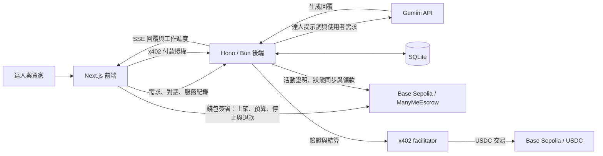

# ManyMe 分身有術

**讓人們按需使用達人經驗的 AI 服務市集。**

> 攻略我看過了，但我家不是範例家庭。

## 問題與目標

出國前，我們會看旅遊達人的攻略；轉職前，會問學長姐的經驗。
找到別人的建議很容易，知道怎麼把它用在自己身上，卻困難得多。
一篇攻略記錄的是作者在他的條件下做出的選擇。這次出國，你帶著爸媽和小孩，
你們的體力、作息和預算，都跟作者不同。

分身有術讓你選擇自己信任的達人，使用他整理的判斷方法：哪些條件應該先確認、
哪些選項不適合，以及為什麼。當你補充新的限制，服務會帶你重新比較選項、理解取捨。

我們先從條件比較多的自由行開始，例如三代同行、帶小孩，或不自駕的旅行。
希望讓好建議，不必靠人脈。完整敘事見 [Pitch Script](docs/PITCH.md)。

## 核心功能

- **達人上架經驗**：把判斷原則、提問方式與案例整理成服務，設定模型與每秒收入，並登記到鏈上。
- **買家按需使用**：選擇服務、設定本次 USDC 預算，透過對話說明需求、補充條件；畫面顯示費用與工作紀錄。
- **結束、退款與領款**：結束服務後，未使用預算退回買家；達人在 Studio 查看並領取收入。
- **單次付費查詢**：透過 x402 支付後取得服務摘要或證據資料，附上付款交易連結。

例如，你可以輸入：「我要帶爸媽和小孩出國，不想自駕，也不想每天換飯店。」
再追問：「如果其中一天遇到下雨，怎麼調整？」服務使用達人設定的流程回應，
結束後由合約結算這次使用的費用。完整操作見[第一次跑作品](docs/BASE-SEPOLIA-DEMO.md)。

## 系統架構



Gemini 處理達人服務的回應，SQLite 保存服務設定與對話紀錄，
Base Sepolia 合約處理預算、計費、退款與收入。鏈上活動證明記錄服務活動，
不保證回答正確。[架構與程式碼導讀](docs/ARCHITECTURE.md) 從一次旅行諮詢串起各段程式。

## 使用技術

| 類型 | 技術／服務 | 用途 |
| --- | --- | --- |
| AI 模型 | Google Gemini API | 依服務設定生成回覆；上架頁從 API 取得可用模型 |
| 前端 | Next.js 14、React、Tailwind CSS | 市集、服務對話、達人工作室 |
| 錢包 | wagmi、viem、RainbowKit | 連接錢包、切換網路與簽署交易 |
| 後端 | Bun、Hono、SQLite | API、SSE、服務執行與紀錄保存 |
| 智慧合約 | Solidity、Foundry、OpenZeppelin | 註冊服務、預算託管、結算與合約測試 |
| 支付與鏈上服務 | Base Sepolia、Circle test USDC、x402 | 測試網上的真實交易與按次付款 |
| Sponsor 技術 | 參賽組別待團隊確認 | 上列為實際使用技術；尚未宣稱符合特定 Challenge／Bounty |

## 安裝與執行

本作品在 **Base Sepolia（chain ID `84532`）** 運行，使用測試 ETH 與測試 USDC。
需要 Gemini API key、測試錢包與已部署的 escrow 合約；核心流程不需要 OKX key。

[完整安裝指南](docs/BASE-SEPOLIA-DEMO.md) 包含工具版本、環境檔設定、領取測試幣、
部署、第一次上架及退款步驟。完成設定後，在專案根目錄執行：

```bash
./run.bash
```

開啟 [http://localhost:3000](http://localhost:3000)，後端位於 `http://localhost:3001`。
啟動器會載入根目錄 `.env`、檢查網路與合約，再啟動前後端及初始化資料庫。
`X402_MOCK=false`，付款會交由 facilitator 驗證與結算。

檢查程式碼可在安裝依賴後執行：

```bash
pnpm --dir backend exec tsc --noEmit
pnpm --dir frontend exec tsc --noEmit --incremental false
(cd backend && bun test)
(cd frontend && bun test)
(cd contracts && forge test)
pnpm --dir frontend build
```

本次文件整理已重跑上述檢查：後端 41、前端 10、合約 26 個測試通過。
驗證環境與範圍見[指南的驗證紀錄](docs/BASE-SEPOLIA-DEMO.md#驗證紀錄)。

## 作品展示

- 評選影片：**待補**。
- 公開展示網址：尚未提供，請依安裝指南在本機體驗。
- 完整對話與追問：**團隊已完成人工驗證**。
- 操作案例與鏈上證據：[展示步驟](docs/BASE-SEPOLIA-DEMO.md#走一次完整流程)。

## 限制與未來工作

這是 BUILDMODE 2026 的 hackathon 作品，目前以本機與 Base Sepolia 為驗證範圍。
請使用專用測試錢包；本機的 Test author／Test payer 連接器由 Next.js 伺服器保管測試私鑰，
只供 localhost 開發使用。合約尚未經獨立安全審計，尚未提供正式營運所需的錢包託管與服務承諾。

目前按使用時間計費，達人每秒收入之外，合約另收每秒 `0.0003 USDC` 平台費。
畫面上的即時費用是估算，最終金額以鏈上結算為準。需要休息時，先結束退款，之後再開新服務；
目前合約沒有手動暫停／恢復功能。生成失敗時會停止更新活動證明，計費受合約 proof window 約束，
未使用預算可退款；這套機制仍可能產生已使用期間的費用。

接下來希望和旅遊達人一起打磨服務內容，再逐步探索轉職與新住民生活等場景。
正式營運前也需要完成安全審計、隱私與資料保存設計，以及多人使用的可靠性驗證。

## 第三方服務、資料與素材

我們使用開源套件、Omnis Labs 的 DeFi skill、Google 字型與圖示，以及外部模型與支付服務。
[第三方來源與授權](THIRD_PARTY_NOTICES.md) 逐項說明來源、用途及授權／服務條款，
並附依賴版本清單。第三方內容保留各自授權；Gemini API 的使用依 Google 的服務條款。

想了解或修改程式，可先看[架構導讀](docs/ARCHITECTURE.md)與[參與開發](CONTRIBUTING.md)。
使用 coding agent 協作時，另有 [AGENTS.md](AGENTS.md) 提供專案約定。

## 團隊成員

| 姓名 | 分工 |
| --- | --- |
| Aidan Tsai | 產品設計、前端、系統整合 |
| Shawn Chang | 區塊鏈、系統整合 |

## License

本專案採用 [MIT License](LICENSE)。第三方套件、匯入內容與素材的授權範圍，
請一併參閱[第三方來源與授權](THIRD_PARTY_NOTICES.md)。
