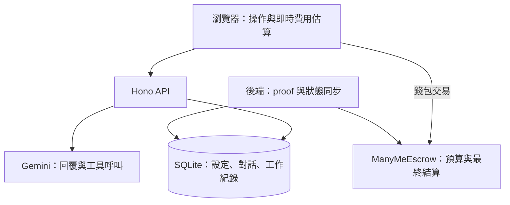

# 架構與程式碼導讀

本文使用「三代旅行規劃師」作為情景範例，說明一次服務從上架、對話到鏈上結算的資料流。
分身有術把達人的方法放進服務設定，讓買家透過對話使用。
前端負責操作與錢包交易，後端負責生成回覆與保存紀錄，合約負責預算與結算。
部署與啟動步驟請看 [Base 部署與啟動](BASE-DEPLOY.md)。

## 從一次旅行諮詢看程式

達人在 `/agents/new` 上架「三代旅行規劃師」，填入提示詞、模型與每秒收入。
前端先完成鏈上註冊，再把設定與已確認的鏈上 ID 送到後端，保存在 SQLite。

買家開啟 `/agents/[id]`，輸入「帶爸媽和小孩去台北半天，不自駕」，設定本次預算。
錢包完成必要的 USDC 授權與 session 存款後，瀏覽器進入 `/sessions/[id]`，
後端使用達人的設定與買家需求呼叫 Gemini，再把回覆與工作進度傳回畫面。
買家追問「下雨要怎麼調整」時，後端接續對話；執行結果會保存，重新載入可以讀回。

使用期間，後端提交活動 proof、同步合約狀態。畫面持續更新估算費用，
最終費用由鏈上結算決定。買家按 End Session 完成停止、退款，達人再從 Studio 領取收入。

| 想理解哪一步 | 先讀這裡 |
| --- | --- |
| 上架畫面與價格輸入 | [`frontend/app/agents/new/page.tsx`](../frontend/app/agents/new/page.tsx) |
| 服務註冊與設定保存 | [`backend/src/api/agents.routes.ts`](../backend/src/api/agents.routes.ts)、[`agentRegistry.ts`](../backend/src/services/agent/agentRegistry.ts) |
| 買家建立服務與存入預算 | [`frontend/app/agents/[id]/page.tsx`](../frontend/app/agents/%5Bid%5D/page.tsx) |
| 對話、結束退款與紀錄恢復 | [`frontend/app/sessions/[id]/page.tsx`](../frontend/app/sessions/%5Bid%5D/page.tsx)、[`sessions.routes.ts`](../backend/src/api/sessions.routes.ts) |
| 模型執行與工具呼叫 | [`agentExecutor.ts`](../backend/src/services/agent/agentExecutor.ts) |
| session 與鏈上狀態協調 | [`liveSessionOrchestrator.ts`](../backend/src/services/session/liveSessionOrchestrator.ts) |
| 活動證明 | [`proofRelayer.ts`](../backend/src/services/proof/proofRelayer.ts) |
| 預算、費用、退款與收入 | [`ManyMeEscrow.sol`](../contracts/src/ManyMeEscrow.sol) |
| 達人領款 | [`frontend/app/studio/page.tsx`](../frontend/app/studio/page.tsx)、[`payoutService.ts`](../backend/src/services/settlement/payoutService.ts) |

## 資料與信任範圍

- **鏈上**：服務登記、預算、已計費金額、活動證明與可領收入；USDC 使用六位小數。
- **鏈下**：提示詞、對話內容、執行紀錄與 UI 狀態；不會把完整對話寫入合約。
- **登入**：錢包簽名後取得短期、綁定錢包的 API 授權；後端重啟後需要重新登入。
- **本機測試錢包**：[`test-wallet/route.ts`](../frontend/app/api/test-wallet/route.ts) 在伺服器端簽署限定的 localhost / Base Sepolia 操作。這是開發用途，不能視為正式錢包託管。

例如達人每秒收入 `0.0097 USDC`，加上平台每秒 `0.0003 USDC`，
買家每秒總費率就是 `0.0100 USDC`。結束時以合約計算的使用金額扣款，剩餘預算可退款。
proof 表示有活動被提交，不代表模型答案正確；停止更新 proof 後，計費受最後 proof 的有效時間限制。

## x402 是另一條付款流程

`/query` 的單次查詢先收到付款要求，瀏覽器簽署 USDC 付款授權，後端交由 facilitator
驗證與結算，再提供資源與付款交易紀錄。這條流程不建立按秒計費的 session。
從 [`x402Server.ts`](../backend/src/services/payments/x402Server.ts) 與
[`queries.routes.ts`](../backend/src/api/queries.routes.ts) 可以追到付款與資料回傳。

## 目錄與修改入口

| 目錄 | 放什麼 |
| --- | --- |
| `frontend/` | Next.js 頁面、錢包操作、Markdown 顯示與費用 UI |
| `backend/` | Hono API、SQLite、模型執行、proof、付款與同步 |
| `contracts/` | Solidity 合約、Foundry 測試與保留原授權的合約依賴 |
| `shared/` | 前後端共用的合約 ABI、型別與設定 |
| `skills/` | 初次初始化使用的範例能力包，來源見[第三方清單](../THIRD_PARTY_NOTICES.md) |
| `scripts/testnet/` | 測試錢包設定、部署與診斷指令 |
| `scripts/start.ts`、`run.bash` | 根目錄環境設定檢查與前後端啟動 |

目前展示以 `/agents`、`/sessions`、`/studio` 與 `/query` 為主。
舊 `/skills`、`/marketplace` 或早期文件中的流程，不宜直接當成現行操作指南；
需要追溯 Skill 上傳與執行的設計時，請看 [Skill Upload & Execution Architecture](SKILL_UPLOAD_ARCHITECTURE.md)。
更動模型、付款或計費時，請同時檢查對應測試與[參與開發](../CONTRIBUTING.md)中的驗證命令。
